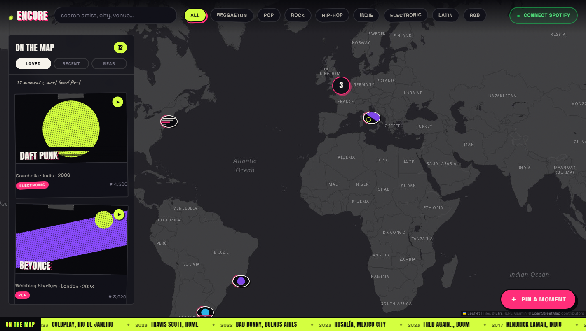
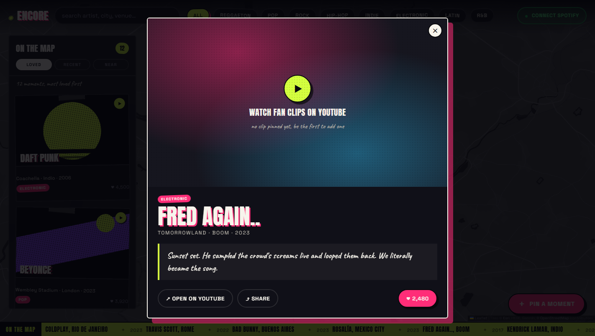
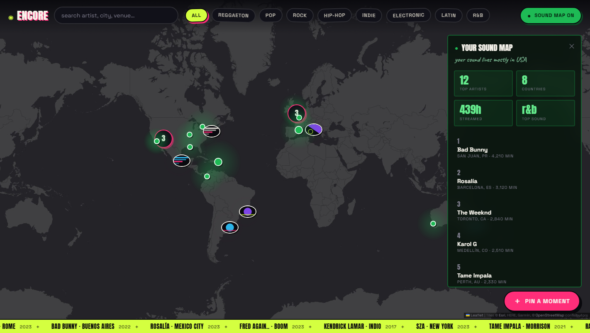

# ◉ ENCORE

**A world map where every pin is a live performance.** The shows you were at, the
ones that meant something, and the ones you missed but can still relive through
fan footage.

> Google Maps shows you *places*. ENCORE shows you the *moments* that happened there.

**[Open the live map](https://andreaisabelmontana.github.io/encore-live-music-map/)**

[](https://github.com/andreaisabelmontana/encore-live-music-map/actions/workflows/ci.yml)
[](https://github.com/andreaisabelmontana/encore-live-music-map/actions/workflows/pages.yml)




---

## What you can do

- **Explore a dark world map** of live music moments. Nearby pins cluster as you
  zoom out.
- **Read the same moments as a list.** The rail beside the map holds whatever the
  map is showing, ordered by hearts, by how recent the night was, or by how close
  it is to the middle of the map. Panning reorders that last one as you go.
- **Open a moment** to see the performance and the story of why it mattered.
- **Search and filter** by artist, city, venue or genre. Search ignores accents,
  so `rosalia` finds Rosalía.
- **Pin your own moment.** Click the map to set the place, paste a YouTube link,
  write what happened. Your pins and hearts survive a reload.
- **Share any moment.** Seed moments share by id. A moment you pinned encodes
  itself into the link, so the person you send it to opens your exact pin with no
  account, no database and no server.
- **Map your listening.** Connect a listening profile and every artist you play
  appears at the city their sound came from, with a panel that graphs the
  geography of your taste.

| | |
|---|---|
|  |  |

## The look

A gig poster stapled to a wall, not app chrome. Two accents on near black, hard
offset shadows instead of soft ones, halftone over the artwork, and condensed
display type doing the work a gradient used to do. Cards hang a degree off
square with tape over the corner and straighten when you reach for them.

Most moments have no clip, so most cards have no photograph. Rather than repeat
one placeholder down the rail, every moment prints its own poster from its own
name: four compositions, five palettes, a halftone at an angle. The same act
always gets the same poster.

[docs/DESIGN.md](docs/DESIGN.md) has the rules, the type system, what each
animation is for, and what the look is not allowed to cost.

## How it is built

The app is plain ES modules with no bundler, no framework and no runtime
dependency beyond Leaflet, which the page loads from a CDN. It is split so that
the rules of the app can be tested without a browser.

```
src/
  main.js          composition root, the only file that wires views together
  core/            pure logic, no DOM, 100% of the unit tests
    moments.js     filtering, accent insensitive search, ranking, distance
    share.js       pack a moment into a link, unpack it safely
    validate.js    one validator, used by the seed data and by shared links
    youtube.js     read an id out of any YouTube link shape, build embed URLs
    soundmap.js    aggregates over a listening profile
    storage.js     local storage that cannot throw
    state.js       a small observable store, plus debounce
    bundle.js      the columnar wire format for the ingested dataset
    poster.js      generated poster artwork, deterministic per moment
    format.js      escaping and display formatting
  ui/              views, each one unaware of the others
    mapView.js     tiles, pins, clustering, and their fallbacks
    feed.js        the keyboard reachable list of every moment on the map
    momentDialog.js, pinForm.js, soundPanel.js, filters.js, splash.js
    dialog.js      focus trap, Escape, focus restore, shared by all three overlays
    thumbnail.js   posters that always render
    motion.js      one place that honours prefers-reduced-motion
    ticker.js      the run of dates along the bottom
scripts/ingest/    the build time data pipeline
    http.mjs       rate limited, retrying, disk cached HTTP client
    musicbrainz.mjs  the three paged reads
    normalize.mjs  a MusicBrainz event into a moment, or a counted reject
    run.mjs        the orchestrator, with a report at the end
data/              curated moments, the ingested dataset, the listening sample
test/              112 unit tests on the Node test runner
```

State lives in one observable store. A handler describes a change, subscribers
redraw. See [docs/ARCHITECTURE.md](docs/ARCHITECTURE.md) for the data flow,
[docs/DECISIONS.md](docs/DECISIONS.md) for why the map has no API key and why
there is no build step, and [docs/DESIGN.md](docs/DESIGN.md) for the visual
system.

## Engineering notes

If you are reviewing the code, these are the parts worth a look.

- **Tested rules.** Every decision the app makes lives in `src/core/` and is
  covered by 112 tests that run in about a second on the Node test runner, with no
  test framework installed. `test/share.test.js` and `test/normalize.test.js` are
  the interesting ones: the first packs a moment into a link and refuses tampered
  ones, the second feeds the pipeline the shapes real archive data actually
  contains.
- **Types without a build.** JSDoc annotations checked by `tsc --checkJs` in
  strict mode. Full type coverage, zero compile step, source that ships as it is
  written. The Leaflet global is typed through `types/globals.d.ts`.
- **Two untrusted inputs, handled as such.** The pin form and the share link
  payload both pass through the same validator before anything renders, no
  dynamic text reaches the page as markup, and the page ships a content security
  policy with no inline script. The CDN tags carry subresource integrity hashes.
- **Everything degrades.** If the cluster plugin does not load, pins still draw.
  If the basemap starts failing, the map falls back to OpenStreetMap darkened in
  the browser. If local storage is blocked, the app runs with nothing saved. If a
  seed moment is malformed, it is dropped and reported rather than rendered.
- **Accessible on purpose.** The map is not keyboard reachable by nature, so
  every moment on it is also a button in the feed, reached by a skip link. All
  three overlays trap focus, close on Escape and return focus where it came from.
  Animation honours `prefers-reduced-motion`, and result counts are announced in
  a live region.
- **Measured performance choices.** Search is debounced before it redraws the
  pin layer, posters load lazily, and the tile provider is preconnected.

## Run it locally

Needs Node 20 or newer. The app has no runtime dependencies; the dev tooling is
the only thing `npm install` fetches.

```bash
npm install
npm start
```

Then open `http://localhost:8080`. The server is forty lines of `node:http` in
`scripts/serve.mjs`, because ES modules do not load over `file://` and that did
not seem worth a dependency.

## Checks

```bash
npm run check
```

Runs ESLint, the type checker, the seed data validator and the test suite. The
same four run in CI on Node 20 and 22, and again before anything deploys to
GitHub Pages.

```bash
npm test            # unit tests
npm run coverage    # unit tests with coverage
npm run lint
npm run typecheck
npm run validate:data
npm run ingest      # rebuild the dataset, or a slice of it
```

The ingest takes flags, because a full run is long and a development run should
not be:

```bash
node scripts/ingest/run.mjs --event-pages 20 --place-pages 20
```

## Where the data comes from

The performances are real, and they arrive through a pipeline rather than by
hand.

A page served from GitHub Pages cannot hold an API key, and it certainly cannot
make a rate limited crawl of a public archive while someone waits. So the
fetching happens at build time. A scheduled workflow runs `npm run ingest`, which
reads MusicBrainz in three passes, joins them, validates every record against the
same rules a shared link has to satisfy, packs the result, and commits it. The
browser only ever downloads a static file.

```
venues   83,164 places, filtered to those with coordinates, the join key
genres   artists per genre tag, because an event carries no genre and one
         lookup per artist would be tens of thousands of requests
events   82,685 concerts, joined to both, normalised, validated, packed
```

Three details are worth opening the code for.

- **The client is polite and stubborn.** One request per second through a single
  queue, retries tuned to a measured refusal rate rather than a guessed one, and
  every response cached on disk, so a failed run resumes instead of restarting.
- **Rejects are counted, not swallowed.** The run reports how many records were
  dropped and why, because a pipeline that silently loses half its input looks
  exactly like one that works.
- **The wire format is columnar.** Artists, venues and genres each appear once in
  a dictionary and every performance is four integers pointing into them. Both
  ends of the format live in `src/core/bundle.js` and the round trip is tested.

`data/moments.json` still holds the curated moments, the ones with a story
attached. Those are written by people. The ingested set is what they sit on.

Every moment carries `videoId: null` until someone attaches a clip. A guessed
YouTube id resolves to the wrong performance, so instead of pretending, a moment
with no clip offers a search for footage of that exact artist, venue and year.
Paste a real link through the pin form and it embeds inline.

## What is still ahead of this

`loadListeningProfile()` in `main.js` reads a sample profile. A real one needs
Spotify OAuth for top artists and MusicBrainz for where each artist is from,
because Spotify exposes the artist but not the origin. That one is a genuine
backend, since OAuth needs a callback the browser cannot fake.

## Roadmap

- [x] Clustering, shareable links, persistent pins, a keyboard path through the app
- [x] A scheduled ingest of real performances from MusicBrainz
- [ ] A spatial index and clustering that hold up at the full dataset size
- [ ] Search that ranks rather than scans
- [ ] Real listening profiles rather than the sample
- [ ] Artist view: every show as a timeline and a touring map
- [ ] Collections, so a set of moments can be saved and shared as one
- [ ] A heat map of the most relived venues
- [ ] Beyond music: festivals, sport, protest, any moment tied to a place

## License

MIT. See [LICENSE](LICENSE).

Seed stories and heart counts are illustrative. Video is embedded from YouTube
and never re-hosted. Basemap tiles come from Esri and OpenStreetMap contributors.
