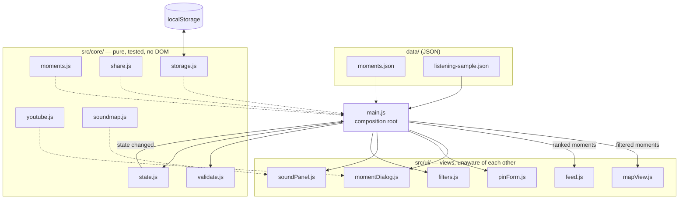

# Architecture

ENCORE is a static site. There is no server, no build step and no framework. What
holds it together is a single rule: **the rules of the app do not touch the DOM,
and the views do not talk to each other.**

## The shape



Solid arrows are data moving. Dotted arrows are logic a caller reaches for.

## One render path

Every visible change follows the same path, which is why there is no way for the
map and the feed to disagree about what is on screen:

1. Something happens. A chip is clicked, a key is typed, a moment is pinned.
2. The handler patches the store: `state.set({ genre: "rock" })`.
3. The store notifies its subscriber, which is `render` in `main.js`.
4. `render` filters the moments once and hands the same list to the chips, the
   feed and the map.

Before this, filter state lived in three module level variables and every handler
had to remember to call three render functions. Missing one was the most common
bug in the app.

## Where the moments come from

```
data/moments.json
  → fetch on boot
  → validateMoment() on every entry, invalid ones dropped and reported
  → merged with your own pins from localStorage
  → stored like counts folded in as deltas, so editing the seed file still shows through
  → the store
```

Like counts for seed moments are stored as a delta rather than an absolute. If
the seed file later says a moment has 3,000 hearts instead of 2,840, a visitor
who added one still sees 3,001 rather than a stale 2,841.

## Two untrusted inputs

Everything else in the app is data the repository controls. These two are not:

| Input | Who controls it | What guards it |
|---|---|---|
| The pin form | the visitor | `validateMoment` before the moment exists, `textContent` on the way to the page |
| A `#p=` share link | anyone who sends one | length ceiling, base64url decode in a `try`, `validateMoment`, identity and heart count assigned locally, never read from the link |

Both end up in the same validator, so the rules cannot drift apart. The content
security policy in `index.html` is the backstop: no inline script anywhere in the
app means a string that somehow became markup still cannot execute.

## Failure modes, and what happens

| What fails | What the visitor sees |
|---|---|
| Leaflet does not load | A message saying so, not a blank page |
| The cluster plugin does not load | Pins draw individually, unclustered |
| The basemap starts failing | The layer swaps to OpenStreetMap, darkened in the browser |
| Local storage is blocked | Everything works, nothing is saved |
| A stored value is unparseable | Treated as absent |
| A seed moment is malformed | Dropped, counted in a console warning, rest of the map renders |
| A share link is tampered with | Ignored, the map opens normally |
| A YouTube poster is missing | A gradient poster, which is also what a moment with no clip gets |

## Testing

`src/core/` is pure by construction, so it is tested directly on the Node test
runner with no framework, no DOM emulation and no mocking library. Where a module
needs something from the environment it takes it as an argument: `createStore`
takes a storage backend, `debounce` takes a scheduler. That is what lets a test
block storage or run a clock forward without touching globals.

`src/ui/` is not unit tested. It is thin by design, and the parts of it worth
testing were moved into `core` instead.
